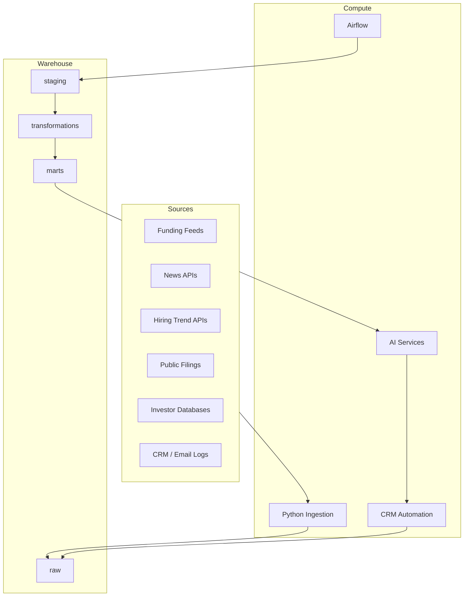

# Architecture

## Repository Architecture
The repository follows a warehouse-centric platform pattern:

- `src/`: Python services for ingestion, orchestration, enrichment wrappers, AI calls, and shared utilities
- `sql/`: warehouse DDL, marts, and warehouse-level tests
- `models/`: dbt-style staging and marts models
- `airflow/`: DAGs for scheduled and backfill workflows
- `sample_data/`: raw and curated fixtures for testing entity matching and scoring
- `dashboards/`: semantic metric definitions
- `infrastructure/terraform/`: infrastructure scaffolding and environment notes
- `docs/`: diagram assets and visual references

## Environment Assumptions
- Cloud provider: AWS
- Warehouse: Snowflake
- Storage: S3
- Orchestration: Airflow
- Language: Python 3.11
- LLM provider: OpenAI
- Vector retrieval: `pgvector` or Snowflake-native vector-compatible pattern
- CRM: Salesforce-first

## High-Level Components
1. Signal ingestion connectors land raw external and CRM data.
2. Snowflake staging models standardize schemas and enforce contracts.
3. SQL transformations build canonical entities and score inputs.
4. Marts publish ranked deal and investor targeting datasets.
5. AI workflows generate strategies and outreach plans.
6. CRM automation jobs create tasks, activities, and notes.
7. Outcome tracking writes back performance and feedback signals.

## System Boundaries

