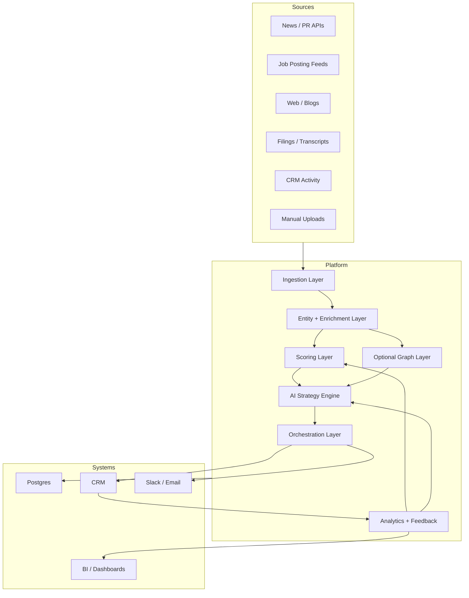
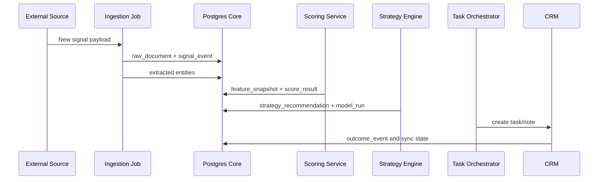

# Architecture

## System Context
`dealflow-ai-engine` sits between external signal sources, internal CRM systems, and downstream analytics. It behaves as both an intelligence platform and an operational automation layer.

## Component Responsibilities

### Ingestion Layer
- Connector adapters per source.
- Incremental extraction and checkpoint storage.
- Raw payload retention.
- Canonical signal normalization and deduplication.

### Entity and Enrichment Layer
- NLP extraction from unstructured signals.
- Match and merge against canonical organizations and people.
- CRM crosswalk management.
- External enrichment snapshots with provenance.

### Scoring Layer
- Feature computation from signals, enrichment, CRM state, and prior outcomes.
- Weighted rules-based ranking first.
- Upgrade path to learning-to-rank or classification models.

### AI Strategy Engine
- Prompt orchestration with structured response contracts.
- Retrieval of playbooks, examples, and prior winning patterns.
- Validation and confidence routing.

### Orchestration Layer
- Task creation and routing.
- SLA and retry policies.
- Integration event delivery to CRM, Slack, and review queues.

### Analytics and Feedback
- Outcome attribution.
- Funnel performance and source quality.
- AI and ranking evaluation dashboards.
- Prompt/model drift and acceptance metrics.

### Optional Graph Layer
- Relationship search for warm intro paths, board overlap, and portfolio adjacency.
- Graph projection from canonical entities and role mappings.

## Key Architecture Decisions
- Postgres is the canonical operational store.
- External systems are accessed through isolated adapters.
- AI output is structured JSON first, narrative second.
- Every recommendation is tied to features, evidence, prompt version, and model run metadata.
- Human review is built into low-confidence resolution and strategy workflows.

## Runtime Boundaries

## Non-Functional Requirements
- Idempotent ingestion and sync jobs.
- Full provenance for externally sourced facts.
- Observable end-to-end flows with run IDs and correlation IDs.
- Configurable cost controls for model usage.
- Environment-aware deployment with promotion gates.
