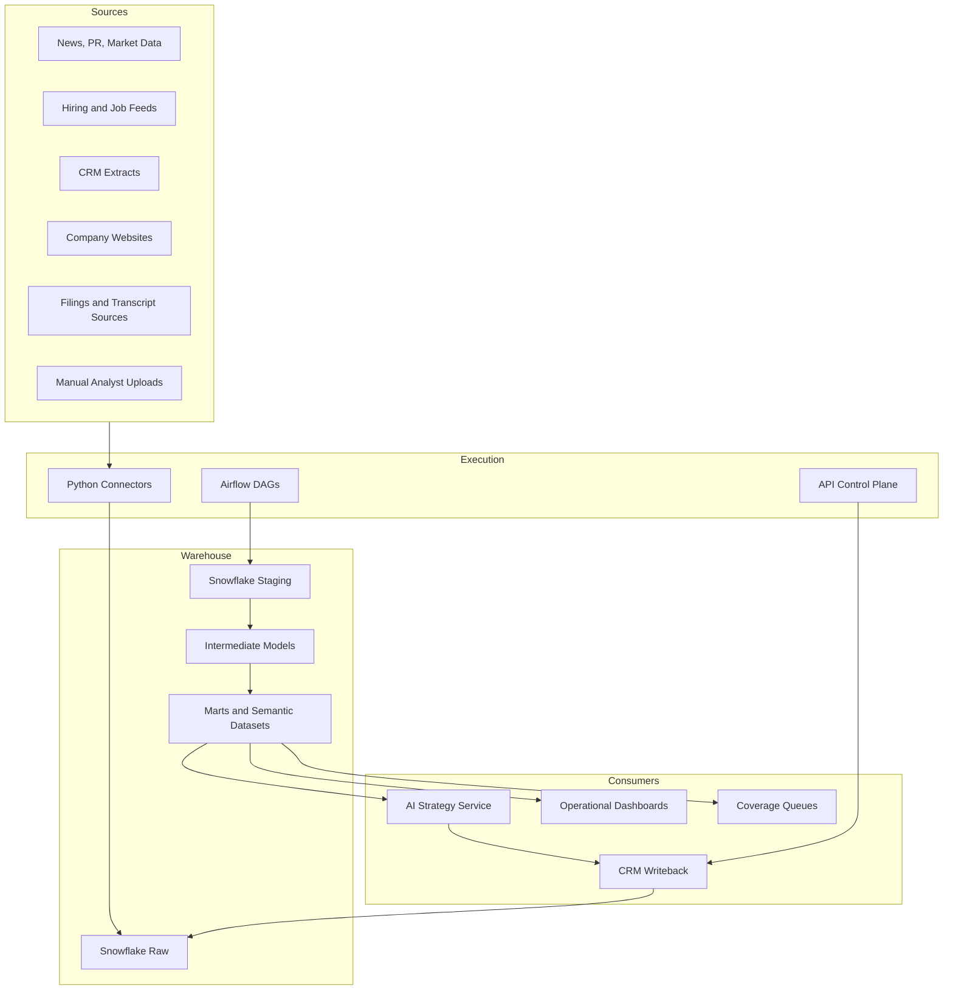
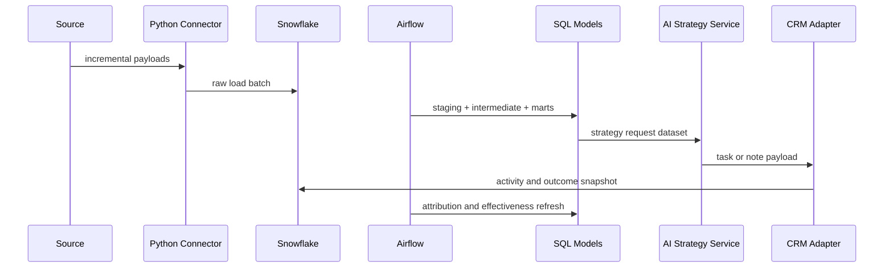

# Architecture

## System Context
`dealflow-ai-engine` is a warehouse-centric platform for signal ingestion, enrichment, ranking, strategy preparation, CRM workflow automation, and outcome measurement. Snowflake holds the curated operating state, Airflow coordinates ingestion and transformation runs, and Python services provide connector logic, orchestration helpers, and tightly scoped APIs.

## Service Boundaries

### Python Layer
- External source connectors and payload loaders.
- Airflow DAG definitions and execution wrappers.
- API endpoints for health, fixture-driven smoke tests, and controlled workflow runs.
- CRM adapter implementations and idempotent writeback helpers.

### Warehouse Layer
- Source-normalized staging models.
- Entity resolution and scoring input models.
- Ranked queue, owner worklist, source quality, and outcome marts.
- Data quality tests and reconciliation queries.

### AI Layer
- Prompt catalog and request/response schemas.
- Strategy request dataset generation from warehouse marts.
- Recommendation storage and feedback capture.

## Architecture Decisions
- Snowflake is the source of curated truth for ranked queues, strategy requests, and platform metrics.
- SQL models own score assembly, prioritization inputs, KPI definitions, and reporting logic.
- Python avoids heavy business transformation logic and instead orchestrates loads, triggers, and integrations.
- CRM writeback is isolated from warehouse scoring to prevent source outages from blocking ranking refreshes.

## Execution Flow

## Non-Functional Requirements
- Idempotent loads using source watermarks and deterministic merge keys.
- Environment separation across development, staging, and production Snowflake objects and Airflow connections.
- Warehouse tests required before queue publication and CRM writeback.
- Full traceability from raw signal to ranked queue, strategy recommendation, and CRM outcome.
