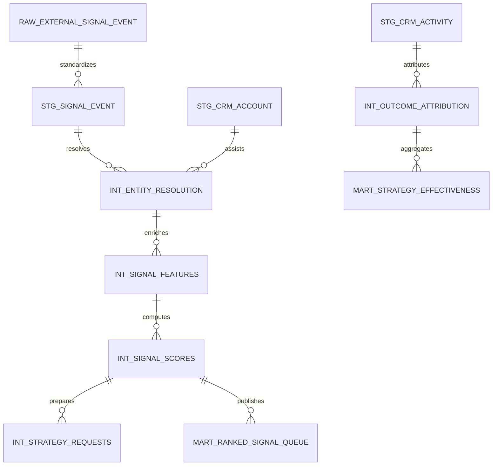

# Data Model

## Modeling Approach
The platform uses a layered Snowflake model:
- Raw landed payloads for replayability.
- Staging models for schema alignment and source normalization.
- Intermediate models for entity resolution, score components, and attribution logic.
- Marts for ranked work queues, performance reporting, and downstream consumers.

## Layered Warehouse Design

### Raw
- `raw.external_signal_event`
- `raw.crm_account_snapshot`
- `raw.crm_activity_snapshot`
- `raw.enrichment_provider_result`

### Staging
- `stg_signal_event`
- `stg_signal_company`
- `stg_signal_person`
- `stg_crm_account`
- `stg_crm_contact`
- `stg_crm_activity`

### Intermediate
- `int_entity_resolution`
- `int_signal_company_match`
- `int_signal_features`
- `int_signal_scores`
- `int_strategy_requests`
- `int_outcome_attribution`

### Marts
- `mart_ranked_signal_queue`
- `mart_owner_worklist`
- `mart_signal_source_quality`
- `mart_strategy_effectiveness`
- `mart_pipeline_conversion`

## Entity Relationships

## Dimensional Guidance
- Conformed dimensions: company, person, coverage owner, geography, sector, signal type, and source system.
- Append-only facts: signal events, CRM activities, CRM tasks, recommendation events, and outcome events.
- Snapshot facts: enrichment state, score components, and daily queue state.
- All score-producing intermediate models preserve component fields for audit and replay.

## Governance Fields
Every curated table should retain:
- `run_id`
- `source_system`
- `source_record_id`
- `loaded_at`
- `model_version`
- `effective_at`

Entity resolution outputs also require:
- `match_method`
- `match_confidence`
- `review_status`

## Snowflake Notes
- Raw schemas can use transient tables where replay from source is available.
- Curated schemas should remain permanent and restatable.
- Large activity and signal facts should cluster by event date and source system where cost warrants it.
