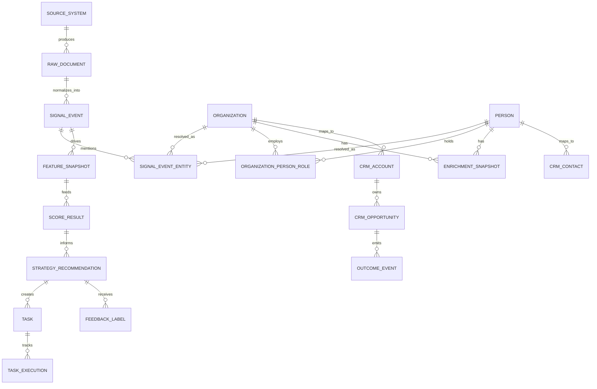

# Data Model

## Modeling Strategy
The platform uses a hybrid operational and analytical model:
- Normalized canonical tables for core business entities.
- Append-only event histories for signals, tasks, and outcomes.
- Snapshot tables for enrichment, features, and AI outputs.
- Analytical marts for reporting and portfolio storytelling.

## Core Domains

### Signal Domain
- `source_system`
- `raw_document`
- `signal_event`
- `signal_event_entity`

### Entity Domain
- `organization`
- `person`
- `organization_person_role`
- `entity_match_decision`
- `enrichment_snapshot`

### CRM Domain
- `crm_account`
- `crm_contact`
- `crm_opportunity`
- `crm_activity`

### Decisioning Domain
- `feature_snapshot`
- `score_result`
- `strategy_recommendation`
- `model_run`
- `task`
- `task_execution`

### Outcomes Domain
- `outcome_event`
- `feedback_label`
- `experiment_assignment`

## Entity Relationship Overview

## Modeling Rules
- Use surrogate UUID primary keys in core tables.
- Preserve source-native IDs as alternate keys where available.
- Apply soft-delete or end-dating rather than destructive deletion for synchronized entities.
- Keep event timestamps separate from ingestion timestamps.
- Store confidence, provenance, and version metadata alongside derived records.

## Lineage Requirements
- Every `signal_event` must point to a `raw_document`.
- Every enrichment field should retain provider/source attribution.
- Every `score_result` must reference the feature snapshot used for the score.
- Every `strategy_recommendation` must reference prompt version and model run.
- Every CRM writeback should persist request/response metadata for audit.

## Storage Guidance
- Operational tables live in Postgres under `core` schemas.
- Analytical marts live under `mart` schemas.
- Optional embeddings use `pgvector`.
- Optional relationship graphs are projected from the canonical model into Neo4j or adjacency tables.
