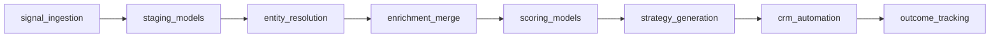

# Pipelines

## Pipeline Structure
The platform uses a layered pipeline:

`raw -> staging -> transformations -> marts`

## Pipeline Families
- Signal ingestion
- Company and investor enrichment
- Entity matching and normalization
- Deal and investor scoring
- AI strategy generation
- CRM lifecycle automation
- Outcome tracking and feedback

## Airflow Workflow Sequence

## Idempotency
- Raw loads keyed by source system and source record id
- Staging deduplication by source id plus event timestamp
- CRM automation keyed by deterministic workflow id
- Backfills rerun safely by date range and source
