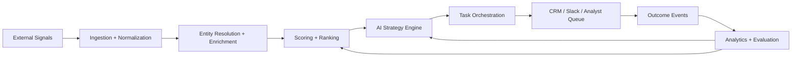

# dealflow-ai-engine

`dealflow-ai-engine` is an AI-driven deal intelligence and CRM lifecycle automation platform that turns external market signals into prioritized recommendations, operational tasks, and measurable outcomes.

## What This Repository Demonstrates
- Event-driven data ingestion and normalization for deal sourcing signals.
- Canonical entity resolution and counterparty enrichment.
- LLM-backed strategy generation with structured outputs and auditability.
- Workflow orchestration for CRM, analyst review, and task automation.
- Feedback-driven evaluation loops across data quality, scoring, and AI outputs.

## Platform at a Glance

## Core Capabilities
- Detect signals from news, websites, job postings, transcripts, filings, and internal CRM activity.
- Resolve organizations and people into canonical master records.
- Rank targets with reproducible features and explainable rules.
- Generate AI-assisted strategy recommendations tied to evidence and model metadata.
- Push tasks into CRM or collaboration tools with idempotent writeback patterns.
- Measure recommendation quality and improve the system through outcome feedback.

## Quick Start
1. Create a Python 3.11 environment.
2. Copy `.env.example` to `.env` and fill in local settings.
3. Start local dependencies with `docker compose up -d postgres`.
4. Install the project with `pip install -e .[dev]`.
5. Run the API locally with `uvicorn dealflow_ai_engine.api.app:app --reload`.
6. Run tests with `pytest`.

## Document Guide
- [PLAN.md](/Users/yasserghias/Documents/Playground/PLAN.md): implementation blueprint.
- [ARCHITECTURE.md](/Users/yasserghias/Documents/Playground/ARCHITECTURE.md): system decomposition and interfaces.
- [DATA_MODEL.md](/Users/yasserghias/Documents/Playground/DATA_MODEL.md): entity model and schema strategy.
- [PIPELINES.md](/Users/yasserghias/Documents/Playground/PIPELINES.md): pipeline lifecycle and orchestration.
- [API_INTEGRATIONS.md](/Users/yasserghias/Documents/Playground/API_INTEGRATIONS.md): external interface contracts.
- [RUNBOOK.md](/Users/yasserghias/Documents/Playground/RUNBOOK.md): operating procedures.

## Current State
This repository is intentionally scaffolded as a production-style starter platform. It includes:
- Detailed architecture and operating documentation.
- SQL DDL, seeds, and quality checks.
- A FastAPI-based internal service skeleton.
- Sample ingestion, scoring, strategy, and CRM integration code.
- Test scaffolding and sample fixtures for extension.

## Design Principles
- Preserve canonical internal data models even when upstream systems vary.
- Make AI outputs structured, versioned, and traceable.
- Prefer evidence-backed automation and human review gates over opaque autonomy.
- Treat observability, governance, and reproducibility as first-class features.
