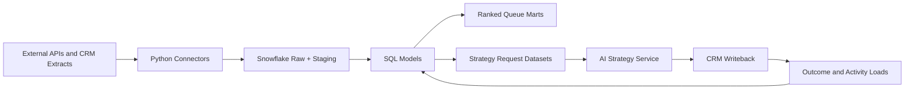

# dealflow-ai-engine

`dealflow-ai-engine` is the platform repository for signal-driven deal intelligence, counterparty enrichment, AI-assisted strategy generation, and CRM workflow automation. The repository is organized around a Snowflake-first warehouse, Airflow-managed orchestration, SQL-owned transformations, and a thin Python layer for integration and control-plane concerns.

## Platform Responsibilities
- Land external signals and CRM extracts into replayable raw datasets.
- Normalize source contracts into canonical warehouse models.
- Publish ranked signal queues and owner worklists from SQL transformations.
- Assemble grounded strategy request datasets for the recommendation service.
- Dispatch approved tasks and notes into CRM systems.
- Measure conversion, latency, source quality, and recommendation effectiveness.

## System Overview

## Key Documents
- [ARCHITECTURE.md](/Users/yasserghias/Documents/Playground/ARCHITECTURE.md)
- [DATA_MODEL.md](/Users/yasserghias/Documents/Playground/DATA_MODEL.md)
- [PIPELINES.md](/Users/yasserghias/Documents/Playground/PIPELINES.md)
- [RUNBOOK.md](/Users/yasserghias/Documents/Playground/RUNBOOK.md)
- [OBSERVABILITY.md](/Users/yasserghias/Documents/Playground/OBSERVABILITY.md)
- [SECURITY.md](/Users/yasserghias/Documents/Playground/SECURITY.md)

## Local Development
1. Copy `.env.example` to `.env`.
2. Install dependencies with `pip install -r requirements.txt`.
3. Start local services with `docker compose up -d`.
4. Run the API with `uvicorn dealflow_ai_engine.api.app:app --reload`.
5. Execute repository validation with `pytest`.

## Operating Principles
- SQL owns transformation, ranking inputs, marts, and data quality rules.
- Python owns source ingestion, orchestration, external adapters, and utility execution wrappers.
- AI output is structured, versioned, evidence-backed, and tied to source warehouse datasets.
- CRM writeback is idempotent and independently controllable from ranking and strategy generation.
