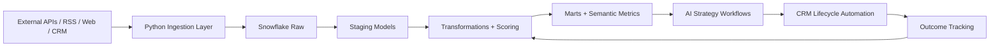

# dealflow-ai-engine

`dealflow-ai-engine` is a production-oriented enterprise data platform for AI-powered deal intelligence and CRM lifecycle automation. The platform detects external market and company signals, enriches companies and investors, publishes SQL-driven prioritization datasets, generates LLM-backed strategies, and automates CRM actions with outcome feedback loops.

## Platform Overview
- Warehouse-first architecture with Snowflake as the analytical system of record
- SQL-heavy transformation layer for entity normalization, scoring inputs, marts, and quality rules
- Python services reserved for ingestion, orchestration, API integrations, LLM calls, and workflow control
- Airflow orchestration for ingestion, enrichment, scoring, AI strategy generation, CRM automation, and backfills

## Core Capabilities
- Signal detection for funding rounds, leadership changes, acquisitions, partnerships, and hiring spikes
- Entity enrichment for companies, investors, contacts, and relationship activity
- Deal strategy generation and outreach planning using LLMs
- CRM automation for task creation, note publishing, and lifecycle updates
- Outcome tracking and feedback loops for self-improving prioritization

## Repository Guide
- [ARCHITECTURE.md](ARCHITECTURE.md)
- [DATA_MODEL.md](DATA_MODEL.md)
- [PIPELINES.md](PIPELINES.md)
- [AI_WORKFLOWS.md](AI_WORKFLOWS.md)
- [RUNBOOK.md](RUNBOOK.md)
- [sql/schema.sql](sql/schema.sql)
- [sql/marts.sql](sql/marts.sql)
- [sql/intermediate.sql](sql/intermediate.sql)
- [sql/reconciliation.sql](sql/reconciliation.sql)
- [sql/metrics.sql](sql/metrics.sql)
- [sql/dimensions.sql](sql/dimensions.sql)
- [sql/facts.sql](sql/facts.sql)
- [sql/incremental_models.sql](sql/incremental_models.sql)
- [sql/reports.sql](sql/reports.sql)
- [sql/source_contracts.sql](sql/source_contracts.sql)
- [sql/procedures.sql](sql/procedures.sql)
- [sql/history.sql](sql/history.sql)
- [sql/quality_checks.sql](sql/quality_checks.sql)
- [sql/backfills.sql](sql/backfills.sql)
- [sql/semantic_layer.sql](sql/semantic_layer.sql)
- [sql/tests.sql](sql/tests.sql)

## Runtime Assumptions
- AWS for infrastructure
- Snowflake for warehouse and semantic datasets
- S3 for raw payload storage
- Airflow for orchestration
- OpenAI for strategy generation and enrichment assistance
- Salesforce-first CRM integration

## Execution Flow

