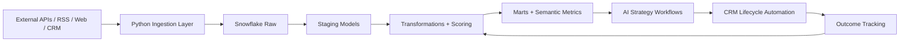

# dealflow-ai-engine

`dealflow-ai-engine` is a production-oriented enterprise data platform for AI-powered deal intelligence and CRM lifecycle automation. The platform detects external market and company signals, enriches companies and investors, publishes SQL-driven prioritization datasets, generates LLM-backed strategies, and automates CRM actions with outcome feedback loops.

## Platform Overview
- Warehouse-first architecture with Snowflake as the analytical system of record
- SQL-heavy transformation layer for entity normalization, scoring inputs, marts, and quality rules
- Python services reserved for ingestion, orchestration, API integrations, LLM calls, and workflow control
- Airflow orchestration for ingestion, enrichment, scoring, AI strategy generation, CRM automation, and backfills

## Core Capabilities
- Signal detection for funding rounds, leadership changes, acquisitions, partnerships, and hiring spikes
- Entity enrichment for companies, investors, contacts, and relationship activity
- Deal strategy generation and outreach planning using LLMs
- CRM automation for task creation, note publishing, and lifecycle updates
- Outcome tracking and feedback loops for self-improving prioritization

## Repository Guide
- [ARCHITECTURE.md](/Users/yasserghias/Documents/Playground/ARCHITECTURE.md)
- [DATA_MODEL.md](/Users/yasserghias/Documents/Playground/DATA_MODEL.md)
- [PIPELINES.md](/Users/yasserghias/Documents/Playground/PIPELINES.md)
- [AI_WORKFLOWS.md](/Users/yasserghias/Documents/Playground/AI_WORKFLOWS.md)
- [RUNBOOK.md](/Users/yasserghias/Documents/Playground/RUNBOOK.md)
- [sql/schema.sql](/Users/yasserghias/Documents/Playground/sql/schema.sql)
- [sql/marts.sql](/Users/yasserghias/Documents/Playground/sql/marts.sql)
- [sql/tests.sql](/Users/yasserghias/Documents/Playground/sql/tests.sql)

## Runtime Assumptions
- AWS for infrastructure
- Snowflake for warehouse and semantic datasets
- S3 for raw payload storage
- Airflow for orchestration
- OpenAI for strategy generation and enrichment assistance
- Salesforce-first CRM integration

## Execution Flow

