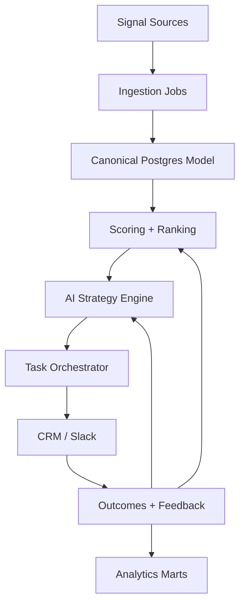

# System Context Diagram

```mermaid
flowchart TB
    A["Signal Sources"] --> B["Ingestion Jobs"]
    B --> C["Canonical Postgres Model"]
    C --> D["Scoring + Ranking"]
    D --> E["AI Strategy Engine"]
    E --> F["Task Orchestrator"]
    F --> G["CRM / Slack"]
    G --> H["Outcomes + Feedback"]
    H --> I["Analytics Marts"]
    H --> D
    H --> E
```
