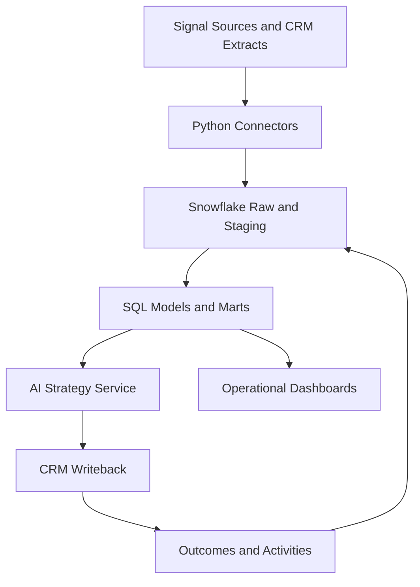

# System Context Diagram

```mermaid
flowchart TB
    A["Signal Sources and CRM Extracts"] --> B["Python Connectors"]
    B --> C["Snowflake Raw and Staging"]
    C --> D["SQL Models and Marts"]
    D --> E["AI Strategy Service"]
    D --> F["Operational Dashboards"]
    E --> G["CRM Writeback"]
    G --> H["Outcomes and Activities"]
    H --> C
```
