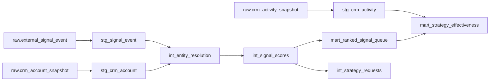

# Warehouse Topology

```mermaid
flowchart LR
    A["raw.external_signal_event"] --> B["stg_signal_event"]
    A2["raw.crm_account_snapshot"] --> C["stg_crm_account"]
    A3["raw.crm_activity_snapshot"] --> D["stg_crm_activity"]
    B --> E["int_entity_resolution"]
    C --> E
    E --> F["int_signal_scores"]
    F --> G["mart_ranked_signal_queue"]
    F --> H["int_strategy_requests"]
    D --> I["mart_strategy_effectiveness"]
    G --> I
```
